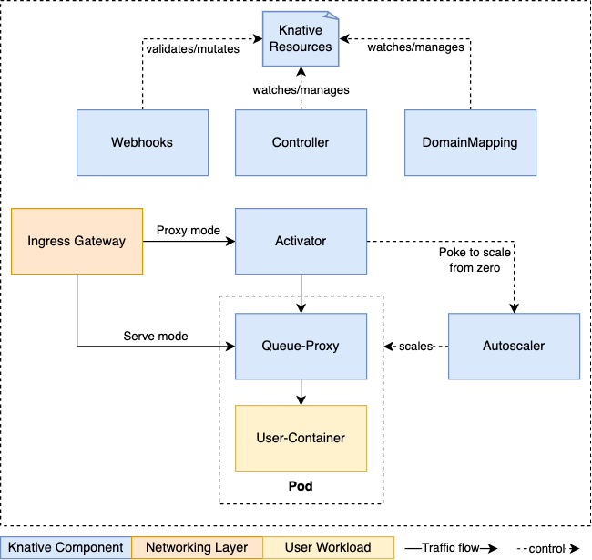
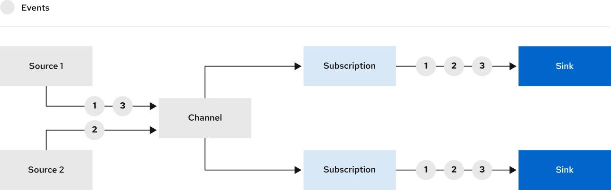

# Red Hat Openshift Serverless Architecture Design and Setup

OpenShift Serverless provides Kubernetes native building blocks that enable developers to create and deploy serverless, event-driven applications on OpenShift Container Platform. OpenShift Serverless is based on the open source Knative project, which provides portability and consistency for hybrid and multi-cloud environments by enabling an enterprise-grade serverless platform.

## Environment

- Openshift 4.13+
- serverless-operator.v1.29.0+

## Knative Serving

### Introduction

Knative Serving defines a set of objects (CRDs) described below to define and control a serverless architecture that supports both HTTP and HTTPS networking protocols.

- __Service__: manages the life cycle of your workload to ensure that the application is deployed and reachable through the network. It creates a route, a configuration, and a new revision for each change to an user created service.
- __Revision__: point-in-time and immutable snapshot of the code and configuration for each modification made to the workload.
- __Route__: maps a network endpoint to one or more revisions.
- __Configuration__: maintains the desired state for your deployment, and it provides a clean separation between code and configuration.

Regarding the components that compose the Knative architecture, the following picture shows them including their interaction workflow:



- __Activator__: It is responsible to queue incoming requests (if a Knative Service is scaled-to-zero) and acts as a request buffer to handle traffic bursts.
- __Autoscaler__: The autoscaler is responsible to scale the Knative Services based on configuration, metrics and incoming requests.
- __Controller__: It watches several objects, manages the lifecycle of dependent resources, and updates the resource state.
- __Queue-Proxy__: The Queue-Proxy is a sidecar container in the Knative Service's Pod. It is responsible to collect metrics and enforcing the desired concurrency when forwarding requests to the user's container. It can also act as a queue if necessary, similar to the Activator.
- __Webhooks__: Knative Serving has several webhooks responsible to validate and mutate Knative Resources.

Regarding HTTP and HTTPS request, it is important to understand how each request is handle by Knative:


Additionally, Openshift Serverless installs a set of components to implement the HTTP Router abstracting customers to this required solution. 


> NOTE: In order to be able to troubleshoot ingress connections, it is possible to configure access logs in the Openshift default router applying the configuration included in the file *files/router-access-log-enable.yaml*.

It is also keep in mind the following information about load balancing:

- Activator pods are scaled horizontally, so there may be multiple Activators in a deployment.

### Setup Knative Serving

- Install Serverless Operator

```$bash
oc apply -f files/serverless-subscription.yaml
```

- Install Knative Serving Architecture

```$bash
oc apply -f files/serverless-serving.yaml
```

- Review the installation

```$bash
oc get pods -n knative-serving
oc get pods -n knative-serving-ingress
```

### Deploy HelloWorld App

- Deploy a HelloWorld application

```$bash
oc apply -f files/serverless-hello-app.yaml
```

- Test HelloWorld Application Deployment

```$bash
# Check Knative Service
$ oc get ksvc hello-app -n hello-app

# Check Configuration Generated 
$ oc get configurations.serving.knative.dev hello-app -n hello-app

# Check revisions
$ oc get revisions.serving.knative.dev -n hello-app

# Check Router
$ oc get routes.serving.knative.dev hello-app -n hello-app

# Check HTTP service
$ URL=$(oc get ksvc -o jsonpath='{.items[0].status.url}' -n hello-app)
$ curl $URL -k
Hello Go Sample v1!
```

### Application Tests

Once the hello world application is deployed, it is possible to define a set of different configurations in order to control the performance of the application modifying the total request received per replica among other things.

The idea in this section is playing with different configurations and observe the Application and Knative solution performance.

- 50 Virtual Users during 30 seconds (Solved by 1 microservice by default)

```$bash
URL=$(oc get ksvc -o jsonpath='{.items[0].status.url}' -n hello-app)
TEST_URL=$URL K6_INSECURE_SKIP_TLS_VERIFY=true k6 run --vus 50 --duration 30s testing/k8-load-test-simple.js
```

- 50 Virtual Users during 30 seconds with a limit of 25 simultaneous requests (Solved by 2 microservice)

```$bash
# Define request limits
oc patch ksvc hello-app -n hello-app  -p '{"spec":{"template":{"metadata":{"annotations":{"autoscaling.knative.dev/target":"25"}}}}}' --type='merge'

# launch the test
URL=$(oc get ksvc -o jsonpath='{.items[0].status.url}' -n hello-app)
TEST_URL=$URL K6_INSECURE_SKIP_TLS_VERIFY=true k6 run --vus 50 --duration 30s testing/k8-load-test-simple.js
```

- 100 Virtual Users during 30 seconds with a limit of 25 simultaneous requests (Solved by 4 microservice)

```$bash
# Define request limits
oc patch ksvc hello-app -n hello-app  -p '{"spec":{"template":{"metadata":{"annotations":{"autoscaling.knative.dev/target":"25"}}}}}' --type='merge'

# launch the test
URL=$(oc get ksvc -o jsonpath='{.items[0].status.url}' -n hello-app)
TEST_URL=$URL K6_INSECURE_SKIP_TLS_VERIFY=true k6 run --vus 100 --duration 30s testing/k8-load-test-simple.js
```

- 25 Virtual Users during 30 seconds with a limit of 25 simultaneous requests and scale with 80%, it means as of 20 request per pod (Solved by 2 microservice)

```$bash
# Define request limits
oc patch ksvc hello-app -n hello-app  -p '{"spec":{"template":{"metadata":{"annotations":{"autoscaling.knative.dev/target-utilization-percentage":"80"}}}}}' --type='merge'
oc patch ksvc hello-app -n hello-app  -p '{"spec":{"template":{"spec":{"containerConcurrency":25}}}}' --type='merge'

# launch the test
URL=$(oc get ksvc -o jsonpath='{.items[0].status.url}' -n hello-app)
TEST_URL=$URL K6_INSECURE_SKIP_TLS_VERIFY=true k6 run --vus 25 --duration 30s testing/k8-load-test-simple.js
```

> NOTE: It is possible to configure Request per Seconds (RPS) policies, additional autoscaling providers, min and max replicas, scale to zero rules, scaling windows, and other strategies, please review autoscaling documentation

## Knative Eventing

### Introducction

Knative Eventing on OpenShift Container Platform enables developers to use an event-driven architecture with serverless applications. An event-driven architecture is based on the concept of decoupled relationships between event producers and event consumers.

Event producers create events, and event sinks, or consumers, receive events. Knative Eventing uses standard HTTP POST requests to send and receive events between event producers and sinks. These events conform to the CloudEvents specifications, which enables creating, parsing, sending, and receiving events in any programming language.

Knative Eventing supports the following use cases:

- Publish an event without creating a consumer
- Consume an event without creating a publisher

Currently, OpenShift Serverless supports the following event source types:

- __API server source__: Brings Kubernetes API server events into Knative
- __Ping source__: Produces events with a fixed payload on a specified cron schedule
- __Kafka event source__: Connects an Apache Kafka cluster to a sink as an event source.

> NOTE: It is possible to create custom event sources

Regarding functional point of view, the following list includes the main components in an event-driven architecture:

- __Event source__: it can be any Kubernetes object that generates or imports cloud events, and relays those events to another endpoint, known as a sink. Sourcing events is critical to developing a distributed system that reacts to events.


- __Brokers__: it can be used in combination with triggers to deliver events from an event source to an event sink. Knative provides a default, channel-based broker implementation. This channel-based broker can be used for development and testing purposes, but does not provide adequate event delivery guarantees for production environments. The default broker is backed by the InMemoryChannel channel implementation by default.

- __Triggers__: After events have entered the broker, they can be filtered by CloudEvent attributes using triggers, and sent as an HTTP POST request to an event sink.

- __Event sink__: An event sink is an addressable or a callable resource that can receive incoming events from other resources. Knative services, channels, and brokers are all examples of event sinks. There is also a specific Apache Kafka sink type available.

On the other hand, we have __Channel and Subscriptions__ that tend to involve a linear flow of events (a "pipeline" of processing), where it is possible to end up provisioning a new Channel and Subscription for each stage of processing. At each stage, the generated events are broadcast to all the downstream Subscriptions on the Channel, and there's no "smarts" in the event-transport layer.



- __Channel__: Channels are custom resources that define a single event-forwarding and persistence layer. After events have been sent to a channel from an event source or producer, these events can be sent to multiple Knative services or other sinks by using a subscription (Available in OCP are _*InMemoryChannel and KafkaChannel_)

- __Subcription__: After you have created a channel and an event sink, you can create a subscription to enable event delivery


### Setup Knative Eventing

- Install Serverless Operator

```$bash
oc apply -f files/serverless-subscription.yaml
```

- Install Knative Eventing Architecture

```$bash
oc apply -f files/serverless-eventing.yaml
```

- Review the installation

```$bash
# Verify Installation
oc get knativeeventing.operator.knative.dev/knative-eventing \
  -n knative-eventing \
  --template='{{range .status.conditions}}{{printf "%s=%s\n" .type .status}}{{end}}'

# Review Knative Eventing Pods
oc get pods -n knative-eventing
```

### Deploy an API Server Source APP (*InMemoryChannel)

In this section, it is included a procedure to deploy an Application that reads API Server events in a specific namespace. These events are generated in openshift and the following objects are required to deploy this example scenario:

- A namespace where the scenario will be deployed (Named __apiserver-app__)
- A service account with specific permissions to read events in this namespace (E.g. Pod creation, Pod deletion, etc)
- A __Knative Source__ that makes possible to consume Openshift events from the Knative architecture
- An application that will receive these event notifications (In this case, knative application)
- A __Knative Broker__ that receive events from the *Knative Source* and deliver them to the respective *Knative Trigger*
- A __Knative Trigger__ that redirect the API server event to the application deployed

In order to implement this scenario, please follow the next steps:

- Deploy a HelloWorld application

```$bash
oc apply -f files/serverless-eventing-apiserver-app.yaml
```

- Test the source, broker, trigger and application are deployed properly

```$bash
oc project apiserver-app

# Review the source
oc get apiserversource.sources.knative.dev testevents

# Review the broker
oc get broker default

# Review the trigger
oc get trigger event-display-trigger

# Review the application that reads events
oc get ksvc event-display
```

- Generate events and verify example application logs

```$bash
oc project apiserver-app

# Create a new deployment
oc create deployment hello-node --image=quay.io/openshift-knative/knative-eventing-sources-event-display

# Review the Application logs
oc logs $(oc get pod -o name | grep event-display) -c user-container
...
☁️  cloudevents.Event
Validation: valid
Context Attributes,
  specversion: 1.0
  type: dev.knative.apiserver.resource.add
  source: https://172.30.0.1:443
  subject: /apis/v1/namespaces/apiserver-app/events/hello-node-685495c99c-qx8z4.177f8ee7874cd1c7
  id: ff953a11-70da-400f-8b28-5c30f69976e5
  time: 2023-08-28T13:25:09.977123445Z
  datacontenttype: application/json
Extensions,
  kind: Event
  knativearrivaltime: 2023-08-28T13:25:09.977400891Z
  name: hello-node-685495c99c-qx8z4.177f8ee7874cd1c7
  namespace: apiserver-app
Data,
  {
    "apiVersion": "v1",
    "count": 1,
    "eventTime": null,
    "firstTimestamp": "2023-08-28T13:25:09Z",
    "involvedObject": {
      "apiVersion": "v1",
      "fieldPath": "spec.containers{knative-eventing-sources-event-display}",
...
```

> NOTE: Please review [InMemoryChannel](https://github.com/knative/eventing/blob/main/config/channels/in-memory-channel/README.md) for more information about the InMemoryChannel backing channel implemented by default using Knative native solution (Multi-tenant channel-based broker (MTChannelBasedBroker) architecture)

### Deploy an APP (*Kafka Broker)

In this section, it is included a procedure to deploy an event-driven architecture and a specific application that will make use of this solution. The idea is to implement Kafka as a Serverless default broker and deploy an application to test the event driven features.

The following components will be deployed following the procedures included in this section:

- A AMQ Streams architecture (*Kafka)
- A namespace where the scenario will be deployed (Named __kafka-broker-app__)
- A pod that implement a __Knative Source__ via Curl generating CloudEvents based on headers
- A knative application that will receive event notifications (type -> event-display)
- A knative application that will receive event notifications (type -> event-display-2)
- A __Knative Broker__ that receives events from the *Knative Source* and deliver them to the respective *Knative Triggers* based on Kafka
- A set of __Knative Triggers__ that redirect the CloudEvents to the respective application deployed

> NOTE: It is important to keep in mind that Knative Serving has to be deployed in order to deploy this use case

Once it is clear the components that will be deployed, it is time to start executing the next procedure:

- Install AMQ Streams Operator

```$bash
oc apply -f files/amq-streams-subscription.yaml
```

- Deploy AMQ Streams Architecture (*kafka)

```$bash
oc apply -f files/amq-streams-configure.yaml
```

- Review the AMQ Streams installations

```$bash
oc get pod -n amq-streams
NAME                                         READY   STATUS    RESTARTS   AGE
my-cluster-entity-operator-dc555f7d5-xbh5v   3/3     Running   0          28m
my-cluster-kafka-0                           1/1     Running   0          29m
my-cluster-kafka-1                           1/1     Running   0          29m
my-cluster-kafka-2                           1/1     Running   0          29m
my-cluster-zookeeper-0                       1/1     Running   0          29m
my-cluster-zookeeper-1                       1/1     Running   0          29m
my-cluster-zookeeper-2                       1/1     Running   0          29m

```

Once the AMW Streams architecture is deployed, it is time to install the Knative Kafka Broker.

- Install the Knative Eventing for Apache Kafka

```$bash
oc apply -f files/serverless-eventing-knative-kafka.yaml
```

- Check Knative Kafka components

```$bash
# Check pods
oc get pod -n knative-eventing
...
kafka-broker-dispatcher-578d4c5d57-2vj46                       2/2     Running     0          3m42s
kafka-broker-receiver-7b97db4b65-p48tn                         2/2     Running     0          3m42s
kafka-channel-dispatcher-7554689668-snrf2                      2/2     Running     0          3m44s
kafka-channel-receiver-dbb7c987b-vbsvd                         2/2     Running     0          3m44s
kafka-controller-6bff7667f-4fc9m                               2/2     Running     0          3m47s
kafka-controller-post-install-1.29.1-xd2z5                     0/1     Completed   0          3m46s
kafka-sink-receiver-85b58dfc8f-qn67f                           2/2     Running     0          3m42s
kafka-webhook-eventing-78fdd8bd44-qqs9c                        2/2     Running     0          3m47s
knative-kafka-storage-version-migrator-1.29.1-gpd7r            0/1     Completed   0          3m46s
...

# Check configuration by default for brokers
oc get cm kafka-broker-config -n knative-eventing
NAME                  DATA   AGE
kafka-broker-config   3      8m42s
```

- Create the respective Knative Broker via Kafka

```$bash
oc apply -f files/serverless-eventing-kafka-broker.yaml
```

- Check Kafka Broker topics created in the AMQ Streams solution

```$bash
oc -n amq-streams  exec -it my-cluster-kafka-0 -- bin/kafka-topics.sh --bootstrap-server my-cluster-kafka-bootstrap:9092 --list
...
knative-broker-kafka-broker-app-kafka-broker-app
...
```

- Create the trigger and the respective kafka service that receives the events

```$bash
oc apply -f files/serverless-eventing-kafka-app.yaml
oc apply -f files/serverless-eventing-kafka-app-2.yaml
```

- Create a test app to generate cloud events

```$bash
oc apply -f files/serverless-eventing-kafka-source.yaml
```

- Generate a cloud event manually via broker ingress

```$bash
POD=$(oc get pods --no-headers -n kafka-broker-app | awk '{ print $1 }' | grep kafka-broker-app-test)
oc -n kafka-broker-app  exec -it $POD bash

bash-4.4$ curl -v "http://kafka-broker-ingress.knative-eventing.svc.cluster.local/kafka-broker-app/kafka-broker-app" \
  -X POST \
  -H "Ce-Id: say-hello" \
  -H "Ce-Specversion: 1.0" \
  -H "Ce-Type: event-display" \
  -H "Ce-Source: curl-pod" \
  -H "Content-Type: application/json" \
  -d '{"msg":"Hello Knative Eventing from test pod - TRIGGER 1!"}'

bash-4.4$ curl -v "http://kafka-broker-ingress.knative-eventing.svc.cluster.local/kafka-broker-app/kafka-broker-app" \
  -X POST \
  -H "Ce-Id: say-hello" \
  -H "Ce-Specversion: 1.0" \
  -H "Ce-type: event-display-2" \
  -H "Ce-Source: curl-pod" \
  -H "Content-Type: application/json" \
  -d '{"msg":"Hello Knative Eventing from test pod - TRIGGER 2!"}'
```

- Verify example application logs (*kafka service that receives the events)

```$bash
oc logs $(oc get pod -o name -n kafka-broker-app | grep event-display | grep -v event-display-2) -c user-container -n kafka-broker-app
...
☁️  cloudevents.Event
Validation: valid
Context Attributes,
  specversion: 1.0
  type: event-display
  source: curl-pod
  id: say-hello
  datacontenttype: application/json
Data,
  {
    "msg": "Hello Knative Eventing from test pod - TRIGGER 1!"
  }
...

oc logs $(oc get pod -o name -n kafka-broker-app | grep event-display-2) -c user-container -n kafka-broker-app
...
☁️  cloudevents.Event
Validation: valid
Context Attributes,
  specversion: 1.0
  type: event-display-2
  source: curl-pod
  id: say-hello
  datacontenttype: application/json
Data,
  {
    "msg": "Hello Knative Eventing from test pod - TRIGGER 2!"
  }
...
```

#### Troubleshooting in AMQ Streams

The following procedures are useful in order to troubleshoot problems in AMQ Streams with topics and messages.

##### Generate an event manually

```$bash
oc -n amq-streams  exec -it my-cluster-kafka-0 -- bin/kafka-console-producer.sh --topic knative-broker-kafka-broker-app-kafka-broker-app --bootstrap-server my-cluster-kafka-bootstrap:9092
...
Hello kafka-broker-app 
...
```

> NOTE: It is required to exit the producer console with "crtl + c"

##### Show number of events in a topic manually (*Optional)

```$bash
oc -n amq-streams  exec -it my-cluster-kafka-0 -- bin/kafka-run-class.sh kafka.tools.GetOffsetShell --topic knative-broker-kafka-broker-app-kafka-broker-app --broker-list my-cluster-kafka-bootstrap:9092 | awk -F  ":" '{sum += $3} END {print "Result: "sum}'
...
Result: 1
...
```

### Deploy an APP (*Kafka Broker Secured)

[link](./docs/knative-kafka-broker-sec.md)

### Deploy a Kafka Sink (Abstract Kafka event subscriptors)

[link](./docs/kafka-sink.md)

### Deploy a Kafka Source (Abstract Kafka event publishers)

[link](./docs/kafka-source.md)

## Links

- [Openshift Serverless Performance Tests](https://docs.openshift.com/serverless/1.29/install/preparing-serverless-install.html#about-serverless-scalability-performance)
- [Configuring Ingress access logging in Openshift Router](https://docs.openshift.com/container-platform/4.13/networking/ingress-operator.html#nw-configure-ingress-access-logging_configuring-ingress)
- [Openshift Serverless KnativeServing CRD](https://github.com/openshift-knative/serverless-operator/blob/main/olm-catalog/serverless-operator/manifests/operator_v1beta1_knativeserving_crd.yaml)
- [Openshift Serverless KnativeServing Autoscaling Configuration](https://docs.openshift.com/serverless/1.29/knative-serving/autoscaling/serverless-autoscaling-developer.html)
- [Multi-tenant channel-based broker (MTChannelBasedBroker) architecture](https://github.com/knative/eventing/tree/main/docs/mt-channel-based-broker)
- [Openshift Serverless KnativeEventing Kafka Broker Installation](https://docs.openshift.com/serverless/1.29/install/installing-knative-eventing.html#serverless-install-kafka-odc_installing-knative-eventing)

## Author

Asier Cidon @RedHat
